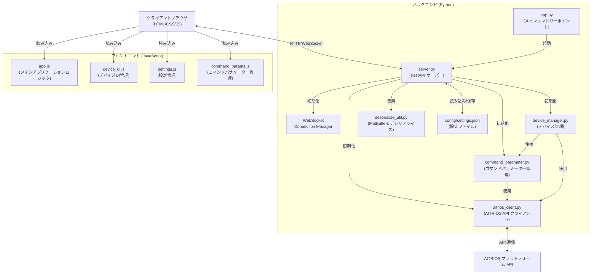

# AITRIOS マルチデバイス人数モニター

## 概要

このシステムは、AITRIOS プラットフォームに接続された複数のデバイスを使用して人数をモニタリングするためのアプリケーションです。バックエンドは Python/FastAPI で実装され、WebSocketとREST APIを通じてフロントエンドと通信します。

## 機能

- 複数デバイスからのリアルタイム人数検出
- 人物検出表示とバウンディングボックス可視化
- WebSocketを使用したリアルタイム更新
- 空き/使用中ステータス管理
- 設定のUIからの管理

## 起動方法

```bash
python3 app.py
```

## 全体構成

```
[クライアントブラウザ]
      ↑↓
      HTTP/WebSocket
      ↑↓
[ウェブサーバー (app.py > uvicorn > FastAPI)] ← [設定ファイル (config/settings.json)]
      ↑↓
[バックエンドモジュール]
      ↑↓
[AITRIOS プラットフォーム API]
```

## 詳細構成



## モジュール説明

### バックエンド (Python)

1. **app.py**
   - アプリケーションのエントリーポイント
   - uvicornサーバーを起動し、FastAPIアプリケーションをホスト

2. **server.py**
   - FastAPIアプリケーションの実装
   - RESTエンドポイントとWebSocket接続の処理
   - クライアントへのリアルタイム更新送信

3. **aitrios_client.py**
   - AITRIOSプラットフォームとの通信を担当
   - APIアクセストークンの管理
   - デバイス情報の取得、推論開始/停止、画像取得などの機能を提供

4. **command_parameter.py**
   - コマンドパラメーターの管理
   - パラメーター取得・適用機能

5. **device_manager.py**
   - 複数デバイスの状態管理
   - 人数カウント・在室状態の管理
   - 推論結果の処理

6. **deserialize_util.py**
   - FlatBuffers形式の推論データをデシリアライズ
   - 検出結果の解析

### フロントエンド (JavaScript)

1. **app.js**
   - メインアプリケーションロジック
   - WebSocket接続と更新処理
   - 全体状態管理

2. **device_ui.js**
   - デバイスカードUIの生成と更新
   - 検出結果の可視化（キャンバス描画）

3. **settings.js**
   - 設定モーダルと設定管理機能
   - APIとの通信・設定保存

4. **command_params.js**
   - コマンドパラメーター設定UI
   - パラメーターのバリデーション

### その他

- **config/settings.json**
  - API認証情報・デバイス設定
  - 空き時間判定設定

- **templates/index.html**
  - メインUI
  - モーダル定義

- **static/css/style.css**
  - UIスタイル定義

## データフロー

1. クライアントブラウザがサーバーに接続
2. サーバーは設定を読み込み、AITRIOSクライアントとデバイスマネージャーを初期化
3. サーバーはWebSocketを通じてクライアントに現在の状態を送信
4. AITRIOSデバイスから推論結果がサーバーに送信される
5. サーバーはデータをデシリアライズして処理
6. 処理結果はWebSocketを通じてクライアントにブロードキャスト
7. クライアントは結果を表示（人数カウント・在室状態）
8. クライアントは設定変更などのアクションをAPI経由でサーバーに送信

## 必要ライブラリ

```
fastapi==0.103.1
uvicorn==0.23.2
websockets==11.0.3
aiofiles==23.2.1
python-multipart==0.0.6
aiohttp==3.8.5
jinja2==3.1.2
flatbuffers==23.5.26
pillow==9.5.0
pydantic==2.3.0
python-dotenv==1.0.0
```

## 設定方法

1. `.env`ファイルを作成し、以下の設定を行います:
   ```
   SERVER_PORT=8080
   SERVER_HOST=0.0.0.0
   DEFAULT_CLIENT_ID=your_client_id
   DEFAULT_CLIENT_SECRET=your_client_secret
   DEFAULT_VACANT_TIME_MINUTES=5
   ```

2. ブラウザから`http://localhost:8080`にアクセス
3. 共通設定で認証情報を入力
4. デバイス設定を行い、AITRIOSデバイスを登録
